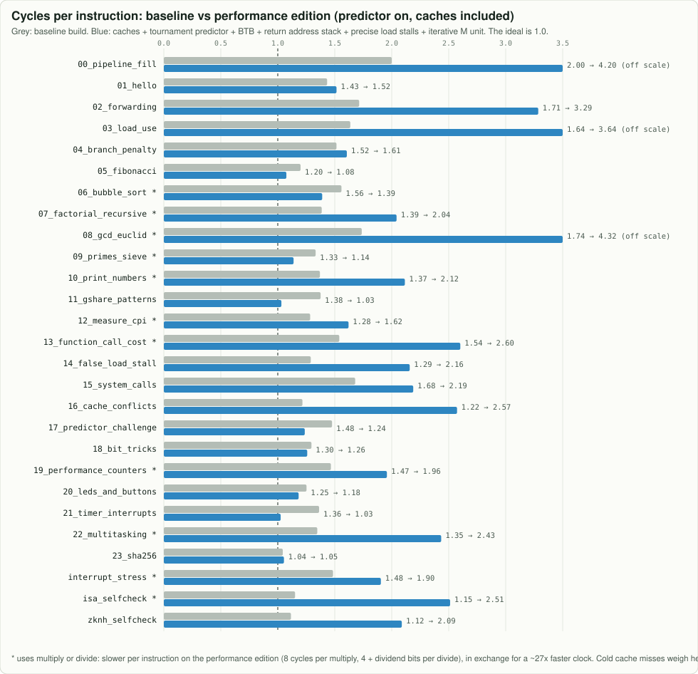

# Sixfold

**Six stages. One instruction per clock. Watch a 64-bit RISC-V processor think.**

Sixfold is a 64-bit RISC-V processor you can read, run, watch, and see as real silicon: a 6-stage pipelined
RV64IM core with the complete B bit-manipulation extension (Zba, Zbb, Zbs), instruction and data caches,
a tournament branch predictor, a branch target buffer, a return address stack, a Wallace-tree multiplier
and hardware performance counters, written in SystemVerilog and built to **teach how a modern RISC-V CPU
works and how to read its diagrams**. It also runs **on an FPGA board** as a small computer with boot
firmware, a serial console, LEDs and buttons ([FPGA.md](docs/FPGA.md)).


| | |
|---|---|
| **Instruction set** | RV64I + M (multiply/divide) + **B = Zba + Zbb + Zbs** (address generation, bit manipulation, single bits: `sh3add`, `clz`, `cpop`, `rev8`, `orc.b`, `min`/`max`, rotates, `bset`/`bclr`/`binv`/`bext`, ...) + Zicsr + **Zknh** (SHA-2, `sha256sig0` ...) + one custom instruction, `hsec.cteq`, added step by step in [chapter 10](docs/learn/10_adding_instructions.md): **122 instructions**, every one documented [in binary](binary/README.md) |
| **Pipeline** | FETCH1 → FETCH2 → DECODE → EXECUTE → MEMORY → WRITEBACK, in order, one instruction per cycle |
| **Hazards** | forwarding into DECODE from EXECUTE / MEMORY / WRITEBACK (the late EXECUTE value takes its own short path), 1-cycle `LOAD_STALL` for loads and the 2-cycle Zbb results (`cpop`, which finishes its count in MEMORY, and `min`, `max`) |
| **Branch prediction** | tournament: a per-branch Branch History Table and `GSharePredictor` (PC xor global history, checkpoint repair) with a chooser; a 16-entry Branch Target Buffer (known taken branches cost 0 cycles); an 8-entry Return Address Stack |
| **Memory** | 4 KiB instruction cache with next-line prefetch and 4 KiB write-through data cache, both 2-way set-associative with LRU replacement and next-line prefetch (32-byte lines), in front of a 10-cycle main memory |
| **Predictor arena** | the real branch stream of each program replayed through a per-branch table, gshare, the tournament, a perceptron and TAGE (the families in AMD Zen and other modern cores): [MODERN_CPUS.md](docs/MODERN_CPUS.md) |
| **Traps** | `ecall`, `ebreak`, `mret` with `mtvec`, `mepc`, `mcause`, `mstatus`, `mscratch`: enough to run a tiny kernel ([`15_system_calls.s`](programs/15_system_calls.s)); timer and external interrupts on top |
| **Performance counters** | `hpmcounter3..9` count the seven bubble kinds of the cycle equation (load stalls, flushes, redirects, multiply/divide, instruction- and data-cache misses, interrupts): a program can measure its own CPI stack ([`19_performance_counters.s`](programs/19_performance_counters.s)) |
| **A tiny OS** | a preemptive round-robin kernel in ~200 lines of assembly: three tasks, timer-driven context switches, task control blocks ([`22_multitasking.s`](programs/22_multitasking.s)) |
| **Interrupts** | precise machine timer and external interrupts (`mie`, `mip`, `wfi`, a memory-mapped MTIME/MTIMECMP timer), taken by replacing the instruction in DECODE: 4 cycles each, and the interrupted program cannot tell ([`21_timer_interrupts.s`](programs/21_timer_interrupts.s), a 388-interrupt stress test) |
| **Multiply / divide** | iterative: a 64 x 16-bit Wallace-tree step with a carry-save accumulator (multiply in 8 cycles), 1 quotient bit per cycle after a leading-zero-counter skip (divide in 5 + significant bits) |
| **Clock (logic only)** | about **244 MHz** on SkyWater 130 nm and **1.95 GHz** on the ASAP7 7 nm research kit, with the full M and B extensions and interrupts: [PERFORMANCE.md](docs/PERFORMANCE.md) |
| **FPGA** | a complete computer around the core: 64 KiB block-RAM main memory, UART with queues, 16 LEDs, 16 switches, 5 buttons, a four-digit seven-segment display, memory-mapped device registers, boot firmware that loads programs over USB and reports PASS and cycles. Builds for the **Digilent Basys 3** (Artix-7 XC7A35T, Vivado: every switch, button, LED and digit; about 86% of the chip), the **ULX3S** (Lattice ECP5-85F, open-source tools, placed and routed here) and the **Arty A7-100T** (Vivado): [FPGA.md](docs/FPGA.md). A hands-on example, [`calculator.s`](fpga/examples/calculator.s), does arithmetic on the switches when you press the buttons and shows the answer on the digits and the LEDs |
| **Two builds** | the performance edition (default) and a simple baseline pipeline (`-DBASELINE`), both in the same RTL behind parameters |
| **Verified** | 23 programs, a 1,630-case self-checking test (expected values from an independent Python model) and a 388-interrupt stress test, predictor on and off, **both builds**: the RTL matches a software twin on **every clock cycle** (100 runs). The FPGA system, booted and fed over its simulated UART, reports the same cycle counts (`make fpga-sim`), the board calculator is driven by simulated buttons and switches, and the board loader runs against a virtual board (`make fpga-load-test`). The RTL also compiles in Icarus Verilog, and every documentation link resolves (`make check-links`) |
| **Silicon** | the original design's real sky130 layout, timing and area, plus sky130 synthesis of this RTL |
| **Runs on** | Icarus Verilog, Verilator, Yosys, nextpnr, Vivado, an FPGA board, any web browser |

## Watch it move

Animated straight from the design (they play right here in the README): the pipeline is a trace of the cycle-exact
model, the multiplier uses real numbers and checks its answer, and the boot sequence runs the real firmware. `make animations` redraws them.


| | |
|---|---|
|  |  |




## How it works, in pictures

### 1. The front end: Branch Target Buffer, Branch History Table, gshare, chooser, Return Address Stack


Every cycle FETCH1 must pick the next PC **before** the instruction it just asked for has even
arrived. Four tables are read in parallel with the instruction cache: the **Branch Target Buffer**
(has this PC jumped before, and where to?), the **Branch History Table** (what does this branch usually
do?), **gshare** (what did it do the last time the recent branches went this way?) and the
**chooser** (which of the two to trust for this branch). FETCH2 corrects the cheap cases (a JAL, a
taken branch the BTB did not know, a `ret` predicted by the **Return Address Stack**) for one lost
cycle; EXECUTE checks every guess, trains every table, and repairs the speculative history after a
wrong one (3 lost cycles). [Chapter 5](docs/learn/05_branch_prediction.md) and [MODERN_CPUS.md](docs/MODERN_CPUS.md) go further
(perceptron, TAGE).

### 2. One cache lookup: set, tags, ways, LRU, refill and prefetch


Both caches split the address into **tag, set and offset**. The set picks one row in each of the two
ways; two comparators check the stored tags against the address tag; a hit returns the data in the
same cycle. A miss stalls for 11 cycles while the refill engine fetches the 32-byte line, evicts the
least-recently-used way, and then fetches the **next** line in the background.

### 3. The memory hierarchy, next to a desktop core


### 4. The multiply/divide unit


A multiply takes 8 cycles: four steps of 64 x 16 bits through a Wallace tree whose running total stays in
carry-save form (two numbers), then one SIGN cycle where a single 128-bit adder sums **and** negates it.
A divide first counts the dividend's leading zeros with a tree, so small numbers finish quickly.

### 5. Operands and the ALU: what stays in the one-cycle loop


The ALU's result is forwarded to the very next instruction in the same cycle, so everything in that loop
decides the clock. DECODE prepares the operands (the Zba shifts, the inverted operand of `andn`), the
value forwarded from EXECUTE gets its own short path, the adder result enters the output multiplexer
last, and the two Zbb operations too deep for the loop (`cpop`, `min`/`max`) get a 2-cycle latency.

### 6. Performance counters: the cycle equation in hardware


### 7. The clock: from 7.5 MHz to 1.95 GHz, and what 2.5 GHz and 5 GHz take


The clock period is the slowest path between two registers. Every "done" step above was measured
with `tools/timing.sh` and verified cycle by cycle against the model; the "next" steps are how
commercial 2.5 to 5 GHz cores get there (deeper pipelines, pipelined caches, out-of-order execution,
custom circuits), each with its price in cycles or area: [PERFORMANCE.md](docs/PERFORMANCE.md).
All these figures are drawn by `make diagrams` from the same parameters as the RTL.

### 8. How the caches connect the pipeline, main memory and the devices


The core has exactly two memory ports, one for instructions (FETCH1) and one for data (EXECUTE). Both
answer in the same cycle on a hit and hold the pipeline on a miss. Behind each cache sits a refill port
that asks main memory for a whole 32-byte line. Stores go straight through to memory. One address range
is not memory at all: it is how the CPU drives the rest of the computer.

### 9. The memory map: memory, device registers and CSRs


A store to 0x1000_0008 lights the LEDs; a load from 0x1000_0010 reads the buttons; a store to 0x1000_0000
sends a character. That is **memory-mapped I/O**: the same `ld`/`sd` instructions, a different address.
The CSRs (`cycle`, the counters, the trap registers, `tohost`) are the other way in, through `csrr`/`csrw`.

### 10. The FPGA computer and how it boots


Like a PC's reset vector pointing into its BIOS, the core starts in boot firmware at address 0
([`fpga/firmware/bios.s`](fpga/firmware/bios.s)). The firmware prints a banner, loads a program sent
from your PC ([`tools/fpga_load.py`](tools/fpga_load.py)) and starts it with a store to the `BOOT`
register. When the program finishes, it reports PASS and the cycle count, which is the same number the
cycle-exact model gives. The whole sequence runs in simulation too: `make fpga-sim`.
[FPGA.md](docs/FPGA.md) has the details and the build steps for every board, and the board sheets are
[Basys 3](docs/boards/BASYS3.md), [ULX3S](docs/boards/ULX3S.md) and [Arty A7-100T](docs/boards/ARTY_A7.md).

On a Basys 3, no PC is needed after programming it: the display says `bIOS`, the centre button runs the
built-in program, and [`calculator.s`](fpga/examples/calculator.s) turns the board into a calculator (switches
15–8 and 7–0 are the numbers; up, down, left and right add, subtract, multiply and divide) and a light
painter. `make fpga-basys3 PROG=calculator` builds it. No board yet? `make fpga-virtual PROG=calculator` runs the
same computer behind a pseudo serial port, so `tools/fpga_load.py` and a terminal work exactly as with a board.

### 11. An interrupt, cycle by cycle


When the timer fires, the instruction in DECODE is set aside and a pseudo-instruction takes its place. In
EXECUTE it traps like `ecall`, with `mepc` pointing at the instruction it replaced. The handler runs, `mret`
returns, and the replaced instruction runs as if nothing had happened. This is a **precise** interrupt: every
older instruction has finished, and no younger one has done anything. It costs 4 cycles.
[`tests/interrupt_stress.s`](tests/interrupt_stress.s) fires 388 interrupts at every kind of instruction
and checks that the result is unchanged. The chart is a real trace from the model, and the RTL matches it
on every cycle.

### 12. A tiny operating system: preemptive multitasking


[`programs/22_multitasking.s`](programs/22_multitasking.s) is a kernel of about 200 lines. Three tasks
share the CPU: one counts primes, one adds squares, and one prints. None of them knows about the others.
Every 600 cycles the timer interrupts the running task, and the kernel does a **context switch**: it saves
the task's 31 registers and PC into that task's control block, loads another task's, and returns into it
with `mret`. That is the core mechanism of every multitasking operating system. Here it costs about 108
cycles per switch.

## Open the live site

[](https://normansrule.github.io/sixfold-cpu/)

The [GitHub Pages site](https://normansrule.github.io/sixfold-cpu/) runs everything in
your browser, with no install:

* **the CPU in 3D**: every die is a real instruction moving through the six stages, with
  forwarding arcs, stalls and flushes as they happen;
* **a bit playground**: flip any of the 32 bits and watch the decoder and its control signals change;
* **a predictor race**: the same program with and without gshare, at any history length;
* **a chip scope**: pan and zoom the real placed-and-routed layout and peel the metal off with a slider;
* **the FPGA computer in your browser**: the boot firmware on a serial console, LEDs and buttons, upload and run;
* **three programs, one CPU**: the tiny operating system of program 22, its tasks taking turns live, with a
  quantum slider and the task control blocks read from memory;
* **a live dashboard** of where every cycle goes, for every program;
* **the lab** ([`web/`](web/index.html)): step forward and back through any program, or your own, or run
  it to the end; see the branch predictor's tables, the trap registers and the timer, and for programs
  that share the CPU, a timeline of who ran when.

Or start with the [learning path](docs/learn/README.md) (9 short chapters) and the
[architecture reference](docs/ARCHITECTURE.md).

---

## Quick start (Ubuntu or WSL)

```bash
sudo apt-get install -y nodejs iverilog verilator yosys graphviz gtkwave python3-serial make git curl unzip
git clone <this repository> && cd sixfold-cpu

make test                          # every program on the RTL and the model, compared cycle by cycle
make run  PROG=05_fibonacci        # registers, cycles, CPI, predictor accuracy
make pipe PROG=03_load_use         # a pipeline chart in your terminal
make cycle PROG=03_load_use C=5    # everything that happens in clock cycle 5
make serve                         # then open http://localhost:8000/ (the site) or /web/ (the lab)
```

## Watch it run

The [web simulator](web/index.html) runs the same cycle-exact model the RTL is tested against. Step
forward and back through a program and see every stage, every forwarded operand, the predictor's
tables (gshare, the per-branch table, the chooser, the BTB and the return address stack), interrupts
and the trap registers, the binary encoding and control signals of each instruction, and the running CPI.


**How to read a pipeline chart:** rows are instructions, columns are clock cycles, each box is the
stage the instruction is in. Rings are forwarded operands, hatched boxes are held by a load stall,
grey crossed-out rows were fetched down a wrong path and squashed. Above: a `jal` squashes one
instruction (FETCH2 redirect), a `ret` squashes three (EXECUTE flush).

## Learn it: ten chapters

| | chapter | picture you will be able to read |
|---|---|---|
| 1 | [What a CPU does](docs/learn/01_what_is_a_cpu.md) | the pipeline staircase |
| 2 | [Instructions are just 32 bits](docs/learn/02_instructions_in_binary.md) | instruction format diagrams |
| 3 | [The six stages and how to read the diagrams](docs/learn/03_the_six_stages.md) | the block diagram above |
| 4 | [Data hazards: forwarding and load stalls](docs/learn/04_data_hazards.md) | forwarding and stall charts |
| 5 | [Control hazards and branch prediction](docs/learn/05_branch_prediction.md) | the 2-bit counter and gshare |
| 6 | [Measuring performance](docs/learn/06_performance.md) | the CPI stack |
| 7 | [From RTL to silicon](docs/learn/07_silicon.md) | a chip layout, a timing path |
| 8 | [Using the CPU: write your own program](docs/learn/08_using_the_cpu.md) | your own program's pipeline |
| 9 | [Devices, interrupts and booting](docs/learn/09_devices_and_interrupts.md) | the memory map, an interrupt cycle by cycle |
| 10 | [Adding an instruction: SHA-2 in hardware, and one of our own](docs/learn/10_adding_instructions.md) | an instruction's bit pattern, through all five layers |

## Instructions in binary


Every instruction has a page in [`binary/`](binary/README.md) with its bit pattern, an example
encoding, the exact control signals `ControlUnit` produces for it, and its journey through the six
stages. Try `node tools/rv.mjs encode "ld a0, 16(sp)"`.

## Faster: shorter critical path, fewer wasted cycles



The baseline divides 64 bits in a single 133 ns cycle; the performance edition divides one bit per
cycle, uses Kogge-Stone prefix adders, and wins cycles back with a tournament predictor, a Branch
Target Buffer, a Return Address Stack and precise load stalls, while its caches make the memory
realistic. A second round of critical-path work (a Wallace-tree multiplier with a carry-save
accumulator, a leading-zero counter tree, decisions taken one stage earlier, and slow control
signals kept off large register enables) took the 7 nm result from 729 ps to 522 ps.
A third round added Zba, Zbb and the counters without slowing the 7 nm clock.
Result: about 234 MHz (logic-only, sky130 typical corner) instead of about 7.5 MHz, and 1.91 GHz for
the same RTL on a 7 nm-class library.
[PERFORMANCE.md](docs/PERFORMANCE.md) has every step, every trade-off (multiply and divide take more
cycles), and what 2.5 GHz and 5 GHz would take.

```bash
make test                                   # both builds, every cycle compared with the RTL
make run PROG=09_primes_sieve               # performance edition
make run PROG=09_primes_sieve CONFIG=baseline   # the original design
make timing                                 # sky130 logic-only clock estimate of both
```

## Branch prediction


The baseline uses 4 history bits (16 counters); the performance edition uses 6, plus a per-branch table and a chooser. The sweep shows why
the "right" size depends on the program, and [SILICON.md](docs/SILICON.md#this-repositorys-64-bit-rtl-on-sky130)
shows the price: the predictor's area grows about 4x for every 2 extra bits.

## Where every cycle goes


The model tags every bubble with its cause, so `cycles = N + 5 + L + 3F + R + K + I + D + X` holds **exactly** for
every program and both builds ([MATH.md](docs/MATH.md), checked by `make math`). Numbers below are the
performance edition.

| program | what it shows | cycles (gshare) | CPI | cycles (predictor off) | CPI |
|---|---|---:|---:|---:|---:|
| [`00_pipeline_fill`](programs/00_pipeline_fill.s) | watch an empty pipeline fill up | 21 | 4.20 | 21 | 4.20 |
| [`01_hello`](programs/01_hello.s) | print a string through memory-mapped I/O | 147 | 1.52 | 144 | 1.48 |
| [`02_forwarding`](programs/02_forwarding.s) | a chain of dependent instructions with ZERO stalls | 23 | 3.29 | 23 | 3.29 |
| [`03_load_use`](programs/03_load_use.s) | the one data hazard forwarding cannot fix | 40 | 3.64 | 40 | 3.64 |
| [`04_branch_penalty`](programs/04_branch_penalty.s) | what a branch costs in this 6-stage pipe | 53 | 1.61 | 76 | 2.30 |
| [`05_fibonacci`](programs/05_fibonacci.s) | iterative Fibonacci, fib(50) in a 64-bit register | 328 | 1.08 | 328 | 1.08 |
| [`06_bubble_sort`](programs/06_bubble_sort.s) | sort 10 signed 64-bit numbers in memory | 1002 | 1.39 | 1115 | 1.55 |
| [`07_factorial_recursive`](programs/07_factorial_recursive.s) | recursion, the stack, CALL and RET | 482 | 2.04 | 482 | 2.04 |
| [`08_gcd_euclid`](programs/08_gcd_euclid.s) | greatest common divisor with REM (M extension) | 82 | 4.32 | 79 | 4.16 |
| [`09_primes_sieve`](programs/09_primes_sieve.s) | Sieve of Eratosthenes | 16899 | 1.14 | 18878 | 1.27 |
| [`10_print_numbers`](programs/10_print_numbers.s) | print Fibonacci numbers in decimal using DIVU/REMU | 1138 | 2.12 | 1262 | 2.35 |
| [`11_gshare_patterns`](programs/11_gshare_patterns.s) | a branch that ALTERNATES taken / not-taken | 1139 | 1.03 | 2020 | 1.83 |
| [`12_measure_cpi`](programs/12_measure_cpi.s) | a program that measures its OWN performance | 154 | 1.62 | 207 | 2.18 |
| [`13_function_call_cost`](programs/13_function_call_cost.s) | why function calls are not free on this pipeline | 294 | 2.60 | 317 | 2.81 |
| [`14_false_load_stall`](programs/14_false_load_stall.s) | a stall caused by bits that only LOOK like a register | 82 | 2.16 | 81 | 2.13 |
| [`15_system_calls`](programs/15_system_calls.s) | traps, the way an operating system gets control | 116 | 2.19 | 119 | 2.25 |
| [`16_cache_conflicts`](programs/16_cache_conflicts.s) | why caches have "ways" | 440 | 2.57 | 472 | 2.76 |
| [`17_predictor_challenge`](programs/17_predictor_challenge.s) | branches that need history, and a branch that needs OTHER branches | 6277 | 1.24 | 8790 | 1.73 |
| [`18_bit_tricks`](programs/18_bit_tricks.s) | the Zba and Zbb extensions, measured against plain RV64I code | 711 | 1.26 | 912 | 1.61 |
| [`19_performance_counters`](programs/19_performance_counters.s) | the cycle equation, counted by the hardware itself | 231 | 1.96 | 258 | 2.19 |
| [`20_leds_and_buttons`](programs/20_leds_and_buttons.s) | talking to devices (memory-mapped I/O) and Zbs | 1196 | 1.18 | 1449 | 1.43 |
| [`21_timer_interrupts`](programs/21_timer_interrupts.s) | a timer interrupt, taken precisely in the middle of a loop | 10056 | 1.03 | 19255 | 2.02 |
| [`22_multitasking`](programs/22_multitasking.s) | a tiny preemptive operating-system kernel, three tasks | 82959 | 2.43 | 90159 | 2.60 |
| [`23_sha256`](programs/23_sha256.s) | SHA-256 with and without the Zknh instructions | 7648 | 1.05 | 8324 | 1.15 |

## Down to silicon

| | |
|---|---|
|  |  |

A 32-bit prototype of this pipeline as placed and routed on SkyWater sky130: register file in purple,
pipeline in red, ALU in orange, gshare in teal, then the metal wiring layer by layer. 26 ns clock,
+0.163 ns slack, 15,753 cells. More than half the clock period is the ALU's ripple-carry adder:


Real sky130 transistor layouts of the gates it is made of (XOR for the gshare index, a flip-flop for
the pipeline registers): [SILICON.md](docs/SILICON.md).

## How we know it works

* `make test`: every program runs on the SystemVerilog RTL (Icarus Verilog) **and** on
  [`model/core.js`](model/core.js). Their per-cycle traces (what is in each of the six stages), the
  cycle count, the output, `tohost` and all 32 registers must match exactly, with the predictor on
  and off. `# EXPECT:` lines in each program are checked too.
* [`tests/isa_selfcheck.s`](tests/isa_selfcheck.s): 1,630 generated test cases whose expected values
  come from an independent Python reference ([`tools/gen_selfcheck.py`](tools/gen_selfcheck.py)).
  It reports through the `tohost` CSR the way riscv-tests do.
* `make lint` and `make fpga-lint`: Verilator with all warnings (except the naming style this code uses on purpose).
* `make fpga-sim`: the whole FPGA computer (block RAM memory, device registers, UART, boot firmware)
  boots in simulation, receives every program over its serial port, runs it and reports. The
  reported cycle count must equal the model's. For the board examples it flips switches and presses
  buttons, and checks what is printed, lit and displayed.
* `make fpga-load-test`: [`tools/fpga_load.py`](tools/fpga_load.py), the program that talks to a real board,
  loads and runs programs on a virtual board behind a pseudo serial port and must read PASS.
* `make check-links`: every relative link, image and `#anchor` in the documentation resolves.
* Continuous integration runs all of it on every push ([`.github/workflows/ci.yml`](.github/workflows/ci.yml)).

## Experiments

Twenty-three labs in [EXPERIMENTS.md](docs/EXPERIMENTS.md): history length, counter reset values, a
multi-cycle divider, removing false load stalls, a return address stack, a branch target buffer, a
faster adder for the critical path, forwarding into EXECUTE, cache experiments, bigger and smarter
predictors, chasing the 7 nm critical path, Booth recoding for the multiplier, your own CPI stack from
the hardware counters, rewriting a program with Zba and Zbb, a bitmap allocator with Zbs, a new device
register for the FPGA computer, a new command for its boot firmware, a pipelined data cache for a
faster FPGA clock, interrupt latency with vectored interrupts, a yield system call for the tiny OS, and your own program for the Basys 3's switches, buttons and digits.

## Repository map

| path | contents |
|---|---|
| [`src/`](src) | the SystemVerilog RTL: `Riscv64.sv` and one file per module ([file list](src/sources.f)) |
| [`tb/`](tb) | the testbench (per-cycle trace, register dump, `+BP=0` to disable prediction) |
| [`fpga/`](fpga) | the FPGA computer: `rtl/` (memory, UART, devices, boot control), `firmware/bios.s`, `sim/`, `boards/` (Basys 3, ULX3S, Arty A7), `examples/` (calculator, interrupt echo) |
| [`model/`](model) | ISA table, assembler, cycle-exact pipeline model (JavaScript) |
| [`programs/`](programs), [`tests/`](tests) | example programs and the self-check |
| [`binary/`](binary/README.md) | every instruction and every program in binary |
| [`docs/`](docs) | [learning path](docs/learn/README.md), [architecture](docs/ARCHITECTURE.md), [performance](docs/PERFORMANCE.md), [modern CPUs](docs/MODERN_CPUS.md), [math](docs/MATH.md), [experiments](docs/EXPERIMENTS.md), [silicon](docs/SILICON.md), [references](docs/REFERENCES.md) |
| [`index.html`](index.html), [`site/`](site) | the GitHub Pages front page: 3D pipeline, bit playground, predictor race, caches, FPGA console, operating system, chip scope, dashboard (vanilla JavaScript modules + vendored three.js, no build step) |
| [`web/`](web/index.html) | the pipeline lab: step-by-step simulator |
| [`tools/`](tools) | CLI, test runner, doc/chart/diagram generators, chip and cell renderers |
| [`docs/silicon/`](docs/silicon) | the 32-bit prototype's placed-and-routed layout (DEF) and timing/power reports |

## Every command

```text
make test / test-model / math        verification (both builds)
make timing                          sky130 logic-only clock estimate (tools/timing.sh performance asap7: 7 nm)
make run / pipe / cycle / bp         explore a program     (PROG=..., BP=0, HIST=6, CONFIG=baseline)
make rtl / vsim / wave               run on Icarus, Verilator, or open GTKWave
make docs / charts / diagram / diagrams / animations / arena   regenerate generated pages and pictures
make synth / schematics              sky130 synthesis per module, Yosys schematics
make lint / serve / clean
```

## Publish the site

```bash
cd ~/sixfold-cpu && git push           # the site is plain static files
# GitHub: Settings -> Pages -> Build and deployment -> Deploy from a branch -> main, / (root) -> Save
# about a minute later: https://<your-user>.github.io/sixfold-cpu/
```

The front page was inspired by interactive explainers such as bbycroft's llm-viz and Georgia Tech's
Transformer Explainer; the 3D view uses three.js (MIT, vendored in `site/vendor/`).

## Credits and license

Designed by Aleksander Norman. SkyWater sky130 cell layouts are Apache-2.0; ASAP7 is used through its
published liberty files for timing only.
Everything else is under the [MIT license](LICENSE).
