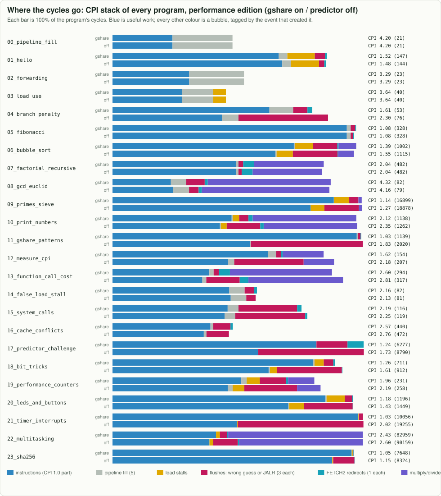

# Experiments and labs

Labs 4 to 8 are now **built** in the performance edition (see [PERFORMANCE.md](PERFORMANCE.md)),
behind parameters. Do them in the other direction: switch one feature off in `src/Riscv64.sv` and
`model/core.js` (`CONFIGS`), predict the change with the cycle equation, then measure it with
`make test` and `make timing`. Or re-implement one yourself from the baseline build.

Each lab changes one thing, predicts the effect with the equation from [MATH.md](MATH.md), then
measures it. Labs 1 to 3 need no code changes. For labs that change the RTL, change
[`model/core.js`](../model/core.js) the same way and keep `make test` passing: the model and RTL
must still agree on every cycle, which is the best proof that you understand your change.

## Lab 1: history length (no code)

```bash
make bp PROG=06_bubble_sort
make bp PROG=09_primes_sieve
```


Measured cycles on the original design ([performance edition table](img/charts/predictor_sweep.md)):

| program | off | 2 bits | **4 bits (baseline)** | 6 bits | 10 bits |
|---|---:|---:|---:|---:|---:|
| 06_bubble_sort | **1069** | 1091 | 1124 | 1073 | 1143 |
| 09_primes_sieve | 20897 | 20152 | **19773** | 19847 | 19876 |
| 11_gshare_patterns | 2106 | 2006 | 1519 | **1517** | 1520 |

Questions: why is bubble sort *faster* with no predictor at 4 bits? (Hint: its inner branch changes
behaviour as the array gets sorted, and each extra history bit gives it more counters to train.)
Combine with the area table in [SILICON.md](SILICON.md): which history length would you tape out?

## Lab 2: counter reset value

Counters reset to `2'b10` (weakly taken), as in the original. Change the reset in
`GSharePredictor` and `GShare` in `model/core.js` to `2'b01` and compare `make bp` results. Which
programs care, and why only at the start?

## Lab 3: the real cost of each hazard (no code)

```bash
make charts
```



For each program, which colour is largest? Predict the new cycle count if that hazard disappeared
completely, using `cycles = N + 5 + L + 3F + R`.

## Lab 4: a multi-cycle divider

The `MultiplyDivideUnit` is combinational: a 64-bit divide in one cycle is a very long path. Replace
it with a 1-bit-per-cycle restoring divider (64 cycles) that stalls EXECUTE. You will need a new
stall source next to `LOAD_STALL` that also holds EXECUTE. Measure CPI on a divide-heavy program.

## Lab 5: remove false load stalls

`LOAD_STALL` compares the rs1/rs2 fields even for instructions that do not read them
([`14_false_load_stall.s`](../programs/14_false_load_stall.s)). Add `USES_REGISTER1` and
`USES_REGISTER2` outputs to `ControlUnit` (U-type, JAL and immediate CSR forms do not use rs1;
only R-type, stores and branches use rs2) and gate the comparison. Expected: `14_false_load_stall`
goes from 25 to 24 cycles; the model's `falseLoadStalls` counter shows how many remain elsewhere.

## Lab 6: a Return Address Stack

Every `ret` (a JALR) flushes 3 instructions ([`13_function_call_cost.s`](../programs/13_function_call_cost.s):
7 cycles per call). Add a small stack: push `PC + 4` in FETCH2 when a JAL writes `ra`, pop it in
FETCH2 for `jalr x0, 0(ra)` and redirect there, then in EXECUTE only flush if the popped address
was wrong. Expected: about 3 fewer cycles per call.

## Lab 7: predict in FETCH1 with a Branch Target Buffer

A correctly predicted taken branch still costs 1 bubble, because the target is only known in FETCH2.
A Branch Target Buffer (BTB) indexed by the PC in FETCH1 can supply the target a cycle earlier.
Measure how much of `R` disappears on `11_gshare_patterns` and what the BTB costs in area (`make synth`).

## Lab 8: attack the critical path

On the original chip, 56% of the 26 ns clock is the ALU's ripple-carry adder
([critical path](img/silicon/critical_path.svg)). Write a parallel-prefix (Kogge-Stone or
Brent-Kung) adder module, use it inside `ALU`, and compare depth with Yosys (`make synth` then look
at the `ALU` cell count and area). Discuss the second half of that path: the stall signal from the
data cache. How would you move that decision off the path?

## Lab 9: forwarding into EXECUTE instead of DECODE

This design (like the original) forwards into DECODE, which puts `EXECUTE_FORWARD_DATA` (the ALU
output) in front of the EXECUTE pipeline register: ALU -> forwarding mux -> register in one cycle.
Textbook pipelines forward into EXECUTE instead. Sketch both paths on the block diagram and explain
which is longer, and what that means for the clock period.

## Lab 10: cache experiments

The caches are parameters of `riscv64_top` (`MISS_LATENCY`) and `CONFIGS` in `model/core.js`
(`missLatency`). Set the latency to 2, 10, 50 and 100 cycles and plot CPI for `09_primes_sieve` and
`tests/isa_selfcheck.s` (17 KiB of code, bigger than the 4 KiB instruction cache). Then turn off the
next-line prefetch in `src/Instruction_Cache.sv` (and `irefill` in the model) and measure how many
instruction misses it was hiding. The caches are 2-way set-associative: make them direct-mapped (1 way) or 4-way and rerun `16_cache_conflicts.s`, which shows 2 arrays fitting and 3 thrashing in the same sets.

## Lab 11: a bigger or smarter predictor

Try 8 or 10 history bits with the tournament chooser, or give the chooser its own history bits. Use
`make bp` and the area numbers from `make synth` to decide whether it is worth the silicon.

## Lab 12: build a better predictor

Use the arena (`node tools/predictor_arena.mjs`) as your testbench: change the perceptron's history
length or the TAGE table sizes in [`model/predictors.js`](../model/predictors.js) and watch accuracy
on `17_predictor_challenge.s`. Then pick one and design it for FETCH1 in SystemVerilog: how many
gate levels does a 16-input perceptron sum need, and does it fit in the clock period
([MODERN_CPUS.md](MODERN_CPUS.md))?


## Lab 13: chase the critical path at 7 nm

`tools/timing.sh performance asap7` prints the longest path and where it starts
(`build/synth/timing_performance_asap7.log` has every gate on it). The second round in
[PERFORMANCE.md](PERFORMANCE.md) took it from 729 ps to 522 ps one change at a time. Undo one of those
changes (for example put the `SUBTRACT_MODE` decode back inside `src/ALU.sv`, or make
`EXECUTE_ALU_INPUT_B` a multiplexer again) and measure how much it was worth. Then try the next one on
the list: register the quotient negation, or split EXECUTE in two and count what the extra bubble
costs with `make math`.

## Lab 14: Booth recoding for the multiplier

`src/Carry_Save_Multiplier.sv` adds 16 partial products per step. Radix-4 Booth recoding looks at
the multiplier bits in overlapping groups of three and produces 8 partial products from
{-2, -1, 0, +1, +2} x the multiplicand. Write it, keep `CarrySaveMultiplyStep`'s ports, and compare
the number of compressor levels, the delay (`tools/timing.sh`) and the area. The 1,630-case self-check
(`make test`) covers MUL, MULH, MULHSU, MULHU and MULW with signed corner cases.

## Lab 15: your own CPI stack, from the hardware counters

`programs/19_performance_counters.s` reads `hpmcounter3..8` (the L, F, R, K, I and D terms of the cycle
equation). Wrap the same reads around another program's main loop (for example `09_primes_sieve.s`) and
explain every number: which loads stall, which branches flush, how many cycles the caches cost. Then
change one thing (predictor off with `BP=0`, a smaller `MISS_LATENCY`) and predict the new counter
values before you run it.

## Lab 16: rewrite a program with Zba and Zbb

`programs/18_bit_tricks.s` measures a popcount loop against `cpop` and a byte-by-byte `strlen` against
`orc.b` + `ctz`. Take `06_bubble_sort.s` and use `sh3add` for the array addresses and `min`/`max` to
swap without a branch. Count instructions and cycles with `rdcycle`/`rdinstret` before and after. Watch
for the 2-cycle latency of `min`/`max`: put an independent instruction between the `max` and its use.

## Lab 17: a bitmap allocator with Zbs

A bitmap keeps one bit per resource (a page, a slot, a file-system block): 1 = in use. With the
single-bit instructions it takes one instruction to allocate (`bset`), free (`bclr`) or test (`bext`)
an entry, and `ctz` of the inverted map finds the first free one. Write `alloc` (find the first 0 bit,
set it, return its index) and `free` for a 64-entry bitmap in one register. Then write the same thing in
plain RV64I (`sll`, `or`, `and`, `not`, a loop instead of `ctz`) and count instructions and cycles.
`programs/20_leds_and_buttons.s` shows every Zbs instruction once.

## Lab 18: add a device register to the FPGA computer

The device registers live in one `case` statement in `fpga/rtl/Sixfold_System.sv` (loads) and a few
`if (DEVICE_STORE && ...)` lines (stores). Add one: for example a 32-bit `PWM` register at offset 0x68
that dims the LEDs (compare it against a free-running counter), or a `RANDOM` register that returns a
new linear-feedback shift register value on every load. Loads must not have side effects (a load can
repeat while the data cache fetches its line), so "take" operations need a store. Add the register to
the table in [FPGA.md](FPGA.md), use it from a program, and check `make fpga-sim` still passes.

## Lab 19: teach the boot firmware a new command

`fpga/firmware/bios.s` is ordinary RISC-V assembly running on the core. Add a command: `d` could dump
16 bytes of memory in hexadecimal starting at an address typed in hex, or `c` could print the last
program's CPI as `LAST_CYCLES` divided by an instruction count you pass back through a register. The
firmware must stay below 0x1000 (`tools/fpga_image.mjs` checks). Test it in simulation first: put your
command's bytes into the upload stream that `fpga/sim/system_testbench.sv` plays, or extend
`tools/fpga_sim.mjs`.

## Lab 20: a pipelined data cache for a faster FPGA clock

On the FPGA the longest path is the data cache ([FPGA.md](FPGA.md#7-results)): the address add, both tag
reads, the compare and a store's write enables all happen in EXECUTE. Real FPGA soft cores split this.
Register the address at the end of EXECUTE, then read and compare the tags in MEMORY: loads get one
more cycle of latency (a load-use now waits two cycles instead of one), and stores write the line one
cycle later, from a small store buffer. Change `src/Data_Cache.sv`, `src/Riscv64.sv` and `model/core.js`
together, keep `make test` cycle-exact, and compare two things: the clock `fpga/boards/ulx3s/build.sh`
reports, and the cycles `make math` counts. Which programs get faster in microseconds, and which get
slower?

## Lab 21: interrupt latency and vectored interrupts

How long does an interrupt take to *start*? Put `rdcycle` at the top of the handler in
`programs/21_timer_interrupts.s`, read `MTIME` there too, and compare with the `MTIMECMP` that fired: the
difference is the latency, from the timer line going up (registered into `mip` one cycle later) to the first
handler instruction. When is it longest? Try a long divide in the main loop: an interrupt waits for an
instruction that holds EXECUTE. Then implement `mtvec`'s **vectored** mode (bit 0 = 1: an interrupt with
cause *n* jumps to `BASE + 4n`) in `src/Riscv64.sv`, `src/Control_Status_Register_File.sv` and
`model/core.js` together, so the handler no longer has to read `mcause` to tell the timer from the UART.
`tests/interrupt_stress.s` and `make test` check that you kept every interrupt precise.

## Lab 22: extend the tiny operating system

`programs/22_multitasking.s` switches between three tasks on every timer tick. Give it a system call:
`ecall` with `a7 = 1` means "yield", so a task that has nothing to do (task 2's delay loop) gives up the
rest of its turn. The handler must tell an `ecall` (mcause 11: `mepc` points at the `ecall`, so add 4)
from a timer interrupt (mcause bit 63 set: `mepc` points at the replaced instruction, so leave it). Then
measure it: how many cycles does the whole program take now, and how much of that is kernel time
(`hpmcounter9` counts the interrupts, `rdcycle` at kernel entry and exit counts the rest)? Try a shorter
quantum too: where does the kernel's share become unreasonable?

## Lab 23: your own board program

Load `fpga/examples/calculator.s` onto a Basys 3 (`make fpga-basys3 PROG=calculator`, or try it in the
site's FPGA console first) and press its buttons: the switches are two numbers, the buttons pick the
operation, the answer goes to the digits and the LEDs. Then change it. Add a fifth operation on the
centre button (the remainder, A AND B, or the greatest common divisor by Euclid's loop of `remu`), or show
answers in hexadecimal when switch 15 is up. Harder: make it count up on the display every second without
blocking the buttons, using the timer interrupt (`programs/21_timer_interrupts.s` shows how). Add your
presses to the program's `# FPGA-STEPS:` lines and its answers to `# FPGA-EXPECT-OUTPUT:`, and
`node tools/fpga_sim.mjs fpga/examples/calculator.s` checks it on the RTL of the whole FPGA computer,
buttons and all.

